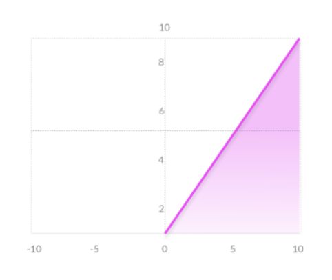

## Video

## Project Summary
Our project attempts to have an agent complete a “Dropper” map, which is a map in which a player attempts to fall safely to the bottom while avoiding obstacles. Our agent will be completing a map in which there is a 5 block wide and 250 blocks high tunnel. Inside the tunnel, there are some randomly generated obsidian obstacles at different locations (By randomly generating the map, the agent sometimes meets a more complex situation: for example, it can go left to avoid hitting an obstacle, but that would cause a dead-end or narrow escape further down). At the bottom of the tunnel, there is a pool of water.

The agent will spawn at the top of the tunnel and begin falling from it. The goal of the mission is to let the agent reach the bottom of the tunnel and land in the pool of water safely without taking any damage. In this process, the agent will strafe in the air by moving in different directions to avoid all obsidian obstacles inside the tunnel to avoid dying from fall damage and make its way to the bottom.

<div style="text-align:center"></div>

This problem isn’t trivial because the solution can be quite complex. There are a lot of ways to reward and punish the agent and finding the best way takes a lot of time. The falling speed of the agent raises another challenge and it is the biggest challenge of this project since we are not able to control the falling speed of the agent, so we can only adjust the value of other parameters to adapt it. Our team has to find the most suitable obstacle density and optimal timing for the agent to perform actions while falling. If the time between actions is too long, the agent makes less move so it will dodge less obstacles, lowering the probability of success. If the time is too short, the rewards do not get registered correctly by Malmo. Also, if the gap between two obstacles is too short, the agent would not have enough time to make a move. The goal for the map and obstacle creation was to make the obstacles and map for the environment realistic and playable enough that even humans could have a decent chance of completing maps. 

To find the most proper way to solve the problems above, our team had to experiment manipulating our environment and trying out several different reinforcement learning algorithms.

## Approaches

Our agent's actions are being rewarded with the following:
**Reward Function**
$$
R(s)=\left\{
	\begin{aligned}
	100 &\ (\text{Agent reaches water safely})\\
	1 &\ (\text{+1 For every millisecond the agent is alive})\\
	-25 &\ (\text{Hitting an obstacle})\\
	\end{aligned}
	\right.
$$

The agent is greatly rewarded with 100 points for completeing the objective and reaching the water safely and is punished for being damaged obstacles without fully dying receiving -25 points. However, we wanted to ensure that the agent wouldn't spend time randomly moving until it luckily lands in the water or hits an obstacle so we added another reward for staying alive as long as possible in order to encourage the agent to dodge obstacles and get lower in the tunnel. Thus we gave the agent 1 point for every millisecond of in-game time it remained alive.

To keep simplicity, our agent always faces the north and only takes discrete actions consisting of:

* Strafe right
* Strafe left
* Move forward
* Move backwards
* Stand still


### DQN
We are primarily using Reinforcement Learning for our approach for the project, using the below DQN algorithm.

$$
Q(S_t, A_t)\leftarrow Q(S_t, A_t) + \alpha[R_{t+1} + \gamma\max_a Q(S_{t+1},a)- Q(s_t, A_t)]
$$

The algorithm can be interpreted as this:
(Updated Q Value) --> (Current Q Value) + (Learning Rate)[Reward + (Discount Rate)*(Max Expected Reward)- (Current Q Value)]

Our agent will take a 3 x 30 x 3 grid of the blocks around it as observation. Since our map is a vertical tunnel and the agent drops from the top of the tunnel, the falling speed of the agent is fast. Therefore, we set the grid so that the agent can 'see' 30 levels or blocks down in order for it to have enough time to dodge obstacles.

Each episode will see the agent taking the above actions until it reaches a terminal state of either successfully landing in the pool of water or dying from hitting an obstacle.

We used several different algorithmic approaches ranging from DQN learning and PPO to train our agent:

For one of our DQN approaches:

```
For each episode:
   While the agent hasn't reached the pool of water or dies:
      Choose an action by applying epsilon greedy policy from Q network
      Take the action
      Get the next observation by check the 3*30*3 grid around the agent
      Calculate the reward
      Update Q network
```

To get the action of each step, we apply the following function from lecture:

$$
\pi(a|s)=\left\{
	\begin{aligned}
	\epsilon/m+1- \epsilon \text{ }[\text{ if a*} = argmax_{(a \in A)} Q(s,a)]\\
	\epsilon/m  \text{  otherwise}\\
	\end{aligned}
	\right.
$$
 
We created an list called action_prob to save the probabilities for each action. Then, we calculate action_prob based on the formula above and randomly choose an action based on the probabilities in action_prob list.

To improve on our baseline DQN algorithm we fixed our implementation of the episilon greedy policy and passed the Q network through a series of layers and activation layers.

##### Activation Function
The activation function is an essential element for neural network. Choosing the right activation function for a layer is important and have a significant impact on the the training process. In the project, we have tried out different activation functions to experiement which of these give us the best result. The three activation functions shown below are used in the project:

<div style="text-align:left"></div> <div style="text-align:center"></div> <div style="text-align:right"></div> 

- Sigmoid: Output values is between range 0-1, which can produce very clear prediction. For very high or low values of x, this function almost doesn't affect the prediction, which may result in the network refusing to learn.

- Tanh: Zero centered, which makes negative, neutral, and strongly positive values easy to distinguish by the model. 

- ReLU: This function allows the network to converge very fast. However, the gradient of the function becomes zero when inputs are close to zero, or are negative and the network cannot learn.

We used a sample of these activation functions to improve our baseline, and determined a series of activation functions the network had to go through that led to decent performing results after numerous trials and tests.


#### Rainbow DQN

We also experimented with one approach as an extension to DQN: Rainbow DQN, a combination of several improvements DQN algorithms. RLlib provided us with an implementation of a standard DQN algorithm, and with a few given modifications we were able to easily transform it to Rainbow DQN.

Essentially, Rainbow DQN is a dubbed term of a combination of extensions of DQN. These include the following: Double Q-learning, prioritized replay, dueling networks, multi-step learning, distributional reinforcement learning, and noisy neural network stream. A more in-depth explanation of these terms are included in the research paper in our [source](https://arxiv.org/pdf/1710.02298.pdf) .


### PPO

We also experimented another reinforcement learning algorithm called Proximal Policy Optimization (PPO) using the Ray RLlib library. PPO explores by sampling actions according to its latest version of its stochastic policy. This randomness depends on the initial conditions of the environment. The stochastic policy eventually becomes less random and encourages the agent to utilize paths to rewards it has found already.

Below is a standard algorithm for PPO, although we used RLlib's implementation of it for use in our project.
```
For each episode:
	For each agent:
		Run stotastic grading policy in environment for set number of time
		Compute advantage estimates at each timestamp
	Optimize surrogate loss function with respect to old policy parameters, with K epochs and a minibatch size ≤ to the number of agents * timesteps
	Replace the old vector of policy parameters with the newly formed one
```

 
## Evaluation

We evaluate our agent on its performance while performing the mission. We originally evaluated our agent solely on its performance on its steps vs return graph but found it to not be incredibly useful. By using graphs of the return values we can see how effectively our agent is learning with our current reward parameters. Though we realized it was not incredibly clear to the viewer of the performance of the agent. We added an extra table to our evaluation set that includes a sample of data between a range of episodes the agent performs in. Each sample of data contains the average return and success rate for that range of episodes. We expected the agent to receive consistently high scores and to learn how to receive the maximum possible rewards, and learn to successfully complete the mission. Over time, we noticed that with our range of reinforcement learning algorithms, our agent improves and on average receives higher results. 


| Syntax      | Description |
| ----------- | ----------- |
| Header      | Title       |
| Paragraph   | Text        |

### DQN

Based on the below data, it is seen that our original implementation of DQN was not very successful. The agent appears to slowly learn to navigate against obstacles and sometimes reach the bottom, but the agent seems to still make some random movements most of the time. While it may have improved slightly, its low success rate was not what our group was looking for. 


<table><tr>
<td>  </td>
<td>  </td>
</tr></table>


<div style="text-align:left"></div>

<div style="text-align:left"></div>


By modifying our implementation of the episilon greedy policy to fix a previous issue with it, and adding additional layers for the neural network to pass through, we received the following results for success. This was to be expected, since as a base, DQN does not perform very well without any modifications.

<div style="text-align:left"></div>


### PPO

Based on the below data, PPO performed reasonably well compared to the others with an approximate success rate at about 20 to 25%. 

<table><tr>
<td>  </td>
<td>  </td>
</tr></table>

<div style="text-align:left"></div>

<div style="text-align:left"></div>

### Rainbow DQN

Based on the below data, the Rainbow DQN algorithm, using RLlib's DQN algorithm with additional hyperparameters performed the best out of the three algorithms we tested. 

<table><tr>
<td>  </td>
<td>  </td>
</tr></table>

<div style="text-align:left"></div>

<div style="text-align:left"></div>


## References
CS175 Assignment 2's DQN algorithm's episilon greedy policy


[Malmo](http://microsoft.github.io/malmo/0.30.0/Documentation/)

[RLlib](https://docs.ray.io/)

[Rainbow DQN](https://arxiv.org/pdf/1710.02298.pdf)

[PPO](https://arxiv.org/pdf/1707.06347.pdf)

PyTorch and TensorFlow library
