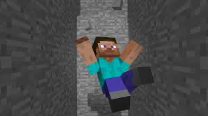

## Welcome to THE DROPPER!
Our project simulates a “Dropper” map. The agent spawns at a high location and begins falling. Its goal is to reach a location at the bottom in which it will land in a pool of water safely. The agent will need to avoid various obstacles in the air in order to avoid dying from fall damage so it can make its way to the bottom. It will do so by strafing in the air by moving in different directions. 

- [Team Info](team.html)
- [Proposal](proposal.html)
- [Status](status.html)
- [Final](final.html)

Source code: [https://github.com/shanshs/Team-Pigeon](https://github.com/shanshs/Team-Pigeon)
