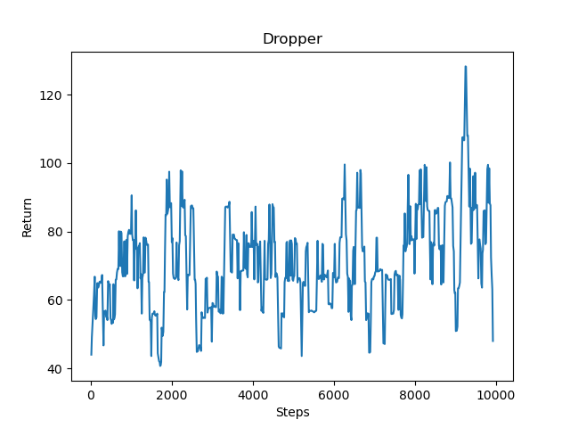
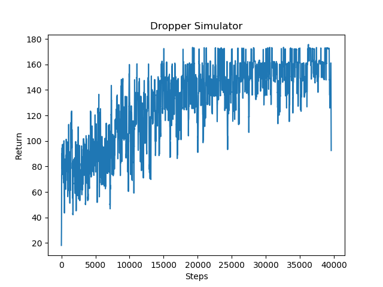

## Video

<iframe width="560" height="315" src="https://www.youtube.com/embed/uR0HirVSii8" frameborder="0" allow="accelerometer; autoplay; clipboard-write; encrypted-media; gyroscope; picture-in-picture" allowfullscreen></iframe>

## Project Summary

Our project attempts to have an agent complete a “Dropper” map, which is a map in which a player attempts to fall safely to the bottom while avoiding obstacles. Our agent will be completing a map in which there is a 5 block wide and 250 block high tunnel made of wool. Inside the tunnel, there are some obsidian obstacles at different locations. At the bottom of the tunnel, there is a pool of water. 

The agent will spawn at the top of the tunnel and begin falling from it. The goal of the mission is to let the agent reach the bottom of the tunnel and land in the pool of water safely without taking any damage. In this process, the agent will strafe in the air by moving in different directions to avoid all obsidian obstacles inside the tunnel in order to avoid dying from fall damage and make its way to the bottom. 

## Approach

Our agent's actions are currently being rewarded with the following:
**Reward Function**
$$
R(s)=\left\{
	\begin{aligned}
	100 &\ (\text{Agent reaches water safely})\\
	1 &\ (\text{+1 For every millisecond the agent is alive})\\
	-25 &\ (\text{Hitting an obstacle})\\
	\end{aligned}
	\right.
$$

The agent is greatly rewarded with 100 points for completeing the objective and reaching the water safely and is punished for hitting obstacles receiving -25 points. However, we wanted to ensure that the agent wouldn't spend time randomly moving until it luckily lands in the water or hits an obstacle so we added another reward for staying alive as long as possible in order to encourage the agent to dodge obstacles and get lower in the tunnel. Thus we gave the agent 1 point for every millisecond it remained alive.

To keep simplicity, our agent always faces the north and only takes discrete actions consisting of:

* Strafe right
* Strafe left
* Move forward
* Move backwards


We are primarily using Reinforcement Learning for our approach for the project, using the below DQN algorithm.

$$
Q(S_t, A_t)\leftarrow Q(S_t, A_t) + \alpha[R_{t+1} + \gamma\max_a Q(S_{t+1},a)- Q(s_t, A_t)]
$$

We used DQN learning to train our agent:

```
For each episode:
   While the agent hasn't reached the pool of water or dies:
      Choose an action by applying epsilon greedy policy from Q network
      Take the action
      Get the next observation by check the 3*3*10 grid around the agent
      Calculate the reward
      Update Q network
```

Our agent will take a 10 x 3 x 3 grid of the blocks around it as observation. Since our map is a vertical tunnel and the agent drops from the top of the tunnel, the falling speed of the agent is fast. Therefore, we set the grid so that the agent can 'see' 10 levels down in order for it to have enough time to dodge obstacles.

Each episode will see the agent taking the above actions until it reaches a terminal state of either successfully landing in the pool of water or dying from hitting an obstacle.
To get the action of each step, we apply the following function from lecture:

$$
\pi(a|s)=\left\{
	\begin{aligned}
	\epsilon/m+1- \epsilon \text{ }[\text{ if a*} = argmax_{(a \in A)} Q(s,a)]\\
	\epsilon/m  \text{  otherwise}\\
	\end{aligned}
	\right.
$$
 
We created an list called action_prob to save the probabilities for each action. Then, we calculate action_prob based on the formula above and randomly choose an action based on the probabilities in action_prob list.


We also experimented another reinforcement learning algorithm called Proximal Policy Optimization (PPO) using the Ray RLlib library. PPO explores by sampling actions according to its latest version of its stochastic policy. This randomness depends on the initial conditions of the environment. The stochastic policy eventually becomes less random and encourages the agent to utilize paths to rewards it has found already.

Currently, we are still working on our approach and are considering changes to other reinforcement learning methods.

## Evaluation

**Quantitative**

We evaluate our agent on its performance with its average score while performing the mission. We expect the agent to receive consistently high scores and to learn how to receive maximum rewards. Over time, we noticed that with our two reinforcement learning algorithms, our agent improves and on average receives a better score.

By using graphs of the return values we can see how effectively our agent is learning with our current reward parameters.

- **DQN**

<div style="text-align:center"></div>

As seen in the graph above, the returns fluctuate quite a bit. This is in part due to the nature of the Dropper. As the agent falls and gets closer to the ground it keeps on gaining points eventually receiving a lot for reaching the water, but should a random action taken due to the e-greedy policy result in its death, the agent loses out on a lot of points and thus has a much lower return value resulting in the many peaks and valleys. Despite this, the graph still shows an overall upward trend, meaning that as time goes on and the number of episodes increases, the agent tends to get farther down and lands in the water much more often.

- **PPO**

<div style="text-align:center"></div>

We also recently tried using a different reinforcement learning algorithm called PPO for our agent. Based on the above graph, the results perform somewhat better than the results with the DQN. PPO is said to have a better convergence and performance rate than a simple DQN model, and it is can be seen that over time the agent performs a bit better. However, it is important to note that the PPO algorithm was run much longer than the DQN algorithm, so while it may yield better results it is much slower.

**Qualitative**

It can be seen that the agent begins taking random moves with a high probability of failing the mission. Over time, gradually the agent learns to dodge the obstacles and succesfully finish the mission.

## Remaining Goals and Challenges
- **Main Goals**
  
  Currently, we are looking to increase our efficiency of the agent to consistently receive the highest reward possible. This will involve modifying the parameters of our DQN or whatever reinforcement learning algorithm we choose.
  
  Additionally, we may try to branch out of discrete actions and try to have our agent move continuously, which simulates how this Minecraft minigame is played by actual players. In this case, the agent would move continuously at varying velocities to avoid obstacles on the map. However, this may be challenging due to the time limit and time window the agent has to send and receive commands. The average time it takes to run one complete episode for the agent is about 7 seconds, with the agent pausing 0.3 seconds before sending another command. We would have to try different reinforcement learning algorithms besides ones that only deal with discrete actions.
  
  A stretch goal for us would be to use computer vision to make decisions for our agent by receiving images to process, as stated in our proposal. We decided not to implement it yet due to us realizing that each episode of the mission is only about 6 or 7 seconds long at best, and we were worried our agent would not be able to receive and process an image in time in order to dodge an obstacle for example.
  
  
- **Randomness**
 
  Right now, the obsidian obstacles inside the tunnel is hardcoded. The locations of the obstacles stay the same for each episode. In the future, we may try to run our agent on randomly generated obstacles for each episode.

- **Reward and Penalty**

  We still need to find the best way to reward or punish the agent so that it learns most optimally. Currently we are using the above rewards for our agent but we have tested and will continue testing different rewards in order to more effectively train our agent. Our rewards also might need to change in response to how our Dropper maps are set up. For example, in a very complex Dropper map with lots of obstacles it might be necessary for our agent to land on an obstacle and walk in a certain direction in order to progress. In this case, harshly punishing the agent for touching an obstacle wouldn't be optimal. Instead we might want to only have a small punishment for touching an obstacle but having a very large punishment if touching the obstacle results in death. 

- **Map Complexity**

  Moreover, we are planning to make our map more complex. We may add a wider tunnel for the final project, or add more obstacles to the map.

## Resources Used
CS175 Assignment 2's DQN algorithm

https://github.com/microsoft/malmo

http://microsoft.github.io/malmo/0.30.0/Documentation/

https://docs.ray.io/en/latest/rllib-algorithms.html#ppo

PyTorch library