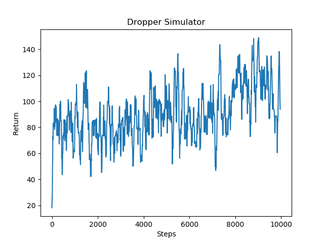

## Video

<iframe width="560" height="315" src="https://www.youtube.com/embed/uR0HirVSii8" frameborder="0" allow="accelerometer; autoplay; clipboard-write; encrypted-media; gyroscope; picture-in-picture" allowfullscreen></iframe>

## Project Summary

Our project attempts to have an agent complete a “Dropper” map, which is a map in which a player attempts to fall safely to the bottom while avoiding obstacles. Our agent will be completing a map in which there is a 5 block wide and 250 block high tunnel made of wool. Inside the tunnel, there are some obsidian obstacles at different locations. At the bottom of the tunnel, there is a pool of water. 

The agent will spawn at the top of the tunnel and begin falling from it. The goal of the project is to let the agent reach the bottom of the tunnel and land in the pool of water safely without taking any damage. In this process, the agent will strafe in the air by moving in different directions to avoid all obsidian obstacles inside the tunnel in order to avoid dying from fall damage and make its way to the bottom. 

## Approach
We are primarily using Reinforcement Learning for our approach for the project.

$$
Q(S_t, A_t)\leftarrow Q(S_t, A_t) + \alpha[R_{t+1} + \gamma\max_a Q(S_{t+1},a)- Q(s_t, A_t)]
$$

We use DQN learning to train our agent:

```
For each episode:
   While the agent hasn't reached the pool of water or dies:
      Choose an action by applying epsilon greedy policy from Q network
      Take the action
      Get the next observation by check the 3*3*10 grid around the agent
      Calculate the reward
      Update Q network
```

Our agent will take a 10 x 3 x 3 grid of the blocks around it as observation. Since our map is a vertical tunnel and the agent drops from the top of the tunnel, the falling speed of the agent is fast. Therefore, we set the grid so that the agent can 'see' 10 levels down in order for it to have enough time to dodge obstacles.
 ```
 OBS_SIZE = 3
 obs = np.zeros((10, OBS_SIZE, OBS_SIZE))
 grid = observations['floorAll'] #From the observation API
 grid_binary = [1 if x == 'obsidian' or x == 'water' else 0 for x in grid]
 obs = np.reshape(grid_binary, (10, OBS_SIZE, OBS_SIZE)
```

We create a function called genMap() to generate the tunnel in the XML. We also use a bool variable called fixed to decide whether to apply randomness for the location of the obstacles or to used a predetermined set of obstacles we created. To keep the simplicity, our agent always faces the north and only takes discrete actions consisting of:

* Strafe right
* Strafe left
* Move forward
* Move backwards

Each episode will see the agent taking the above actions until it reaches a terminal state of either successfully landing in the pool of water or dying from hitting an obstacle.
To get the action of each step, we apply the following function from lecture:

$$
\pi(a|s)=\left\{
	\begin{aligned}
	\epsilon/m+1- \epsilon \text{ }[\text{ if a*} = argmax_{(a \in A)} Q(s,a)]\\
	\epsilon/m  \text{  otherwise}\\
	\end{aligned}
	\right.
$$
 
We create an array called action_prob to save the probabilities for each action. Then, we calculate action_prob base on the formular above and use np.random.choice chooses an action based on the probabilities in action_prob array.


```
 def get_action(obs, q_network, epsilon):
    with torch.no_grad():
        # Calculate Q-values for each action
        obs_torch = torch.tensor(obs.copy(), dtype=torch.float).unsqueeze(0)
        action_values = q_network(obs_torch)

        action_prob = [epsilon/4.0, epsilon/4.0, epsilon/4.0, epsilon/4.0]
        actions = [0, 1, 2, 3]

        # Select action with highest Q-value
        action_idx = torch.argmax(action_values).item()

        action_prob[action_idx] += (1-epsilon)
        action_i = np.random.choice(actions, p=action_prob)
        
    return action_i
```

## Evaluation

Our agent's actions are currently being rewarded with the following:
**Reward Function**
$$
R(s)=\left\{
	\begin{aligned}
	100 &\ (\text{Agent reaches water safely})\\
	1 &\ (\text{+1 For every millisecond the agent is alive})\\
	-25 &\ (\text{Hitting an obstacle})\\
	\end{aligned}
	\right.
$$

The agent is greatly rewarded with 100 points for completeing the objective and reaching the water safely and is punished for hitting obstacles receiving -25 points. However, we wanted to ensure that the agent wouldn't spend time randomly moving until it luckily lands in the water or hits an obstacle so we added another reward for staying alive as long as possible in order to encourage the agent to dodge obstacles and get lower in the tunnel. Thus we gave the agent 1 point for every millisecond it remained alive.

By using graphs of the return values we can see how effectively our agent is learning with our current reward parameters.

<div style="text-align:center"></div>

As seen in the graph above, the returns fluctuate quite a bit. This is in part due to the nature of the Dropper. As the agent falls and gets closer to the ground it keeps on gaining points eventually receiving a lot for reaching the water, but should a random action taken due to the e-greedy policy result in its death, the agent loses out on a lot of points and thus has a much lower return value resulting in the many peaks and valleys. Despite this, the graph still shows an overall upward trend, meaning that as time goes on and the number of episodes increases, the agent tends to get farther down and lands in the water much more often.

## Remaining Goals and Challenges
- **Randomness**
 
  Right now, the obsidian obstacles inside the tunnel is hardcoded. The locations of the obstacles stay the same for each episode. In the future, we may try to run our agent on randomly generated obstacles for each episode.

- **Reward and Penalty**

  We still need to find the best way to reward or punish the agent so that it learns most optimally. Currently we are using the above rewards for our agent but we have tested and will continue testing different rewards in order to more effectively train our agent. Our rewards also might need to change in response to how our Dropper maps are set up. For example, in a very complex Dropper map with lots of obstacles it might be necessary for our agent to land on an obstacle and walk in a certain direction in order to progress. In this case, harshly punishing the agent for touching an obstacle wouldn't be optimal. Instead we might want to only have a small punishment for touching an obstacle but having a very large punishment if touching the obstacle results in death. 

- **Map Complexity**

  Moreover, we are planning to make our map more complex. currently, we only have a vertical tunnel. We may add a horizontal tunnel for the final project, or add more obstacles to the map.
  
- ** Other Goals**
  
  Currently, we are looking to increase our efficiency of the agent to consistently receive the highest reward possible. 
  Additionally, we may try to branch out of discrete actions and try to have our agent move continuously, which simulates how this Minecraft minigame is played by actual players. In this case, the agent would move continuously at varying velocities to avoid obstacles on the map. However, this may be challenging due to the time limit and time window the agent has to send and receive commands. The average time it takes to run one complete episode for the agent is about 7 seconds, with the agent pausing 0.3 seconds before sending another command. We would have to try different reinforcement learning algorithms besides ones that only deal with discrete actions.

## Resources Used
Python Malmo libraries and documentation: 
https://github.com/microsoft/malmo
http://microsoft.github.io/malmo/0.30.0/Documentation/

PyTorch library

CS175 Assignment 2 DQN algorithm
