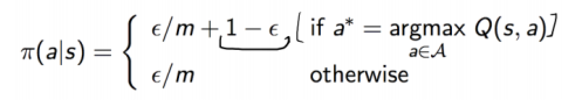

## Project Summary

Our project simulates a “Dropper” map, which is a 5 block wide and 250 block high tunnel made of wool. Inside the tunnel, there are some obsidian obstacles at different locations. At the bottom of the tunnel, there is a pool of water. 

The agent will spawn at the top of the tunnel and begin falling from it. The goal of the project is to let the agent reach the bottom of the tunnel and land in the pool of water safely without taking any damage. In this process, the agent will strafe in the air by moving in different directions to avoid all obsidian obstacles inside the tunnel in order to avoid dying from fall damage and make its way to the bottom. 

## Approach
We are using primarily Reinforcement Learning for our approach for the project.

$$
Q(S_t, A_t)\leftarrow Q(S_t, A_t) + \alpha[R_{t+1} + \gamma\max_a Q(S_{t+1},a)- Q(s_t, A_t)]
$$

We use DQN learning to train our agent:

```
For each episode:
   While the agent hasn't reached the pool or die:
      Choose an action by applying epsilon greedy policy from Q network
      Take the action
      Get the next observation by check the 3*3*10 grid around the agent
      Calculate the reward
      Update Q network
```

We create a function called genMap() to generate the XML for the tunnel. We also use a bool variable called fixed to decide whether to apply randomness for the location of the obstacles. To keep the simplicity, our agent always face to the north and moves only in discrete actions (never turn).

* Move right
* Move left
* Move forward
* Move backwards
	
**Reward Function**
$$
R(s)=\left\{
	\begin{aligned}
	100 &\ (\text{Agent reaches water safely})\\
	1 &\ (\text{Time Agent stays alive (in milliseconds)})\\
	-25 &\ (\text{Damage from obstacle, without dying})\\
	\end{aligned}
	\right.
$$

Since our map is a vertical tunnel and the agent drops from the top of tunnel, the falling speed of the agent is fast. Therefore, we set the y = 10 so that the agent can 'see' 10 levels down.
 ```
 OBS_SIZE = 3
 obs = np.zeros((10, OBS_SIZE, OBS_SIZE))
 grid = observations['floorAll'] #From the observation API
 grid_binary = [1 if x == 'obsidian' or x == 'water' else 0 for x in grid]
 obs = np.reshape(grid_binary, (10, OBS_SIZE, OBS_SIZE)
```

To get the action of each step, we apply the following function from lecture:
<div style="text-align:center"></div>

$$
\pi(a|s)=\left\{
	\begin{aligned}
	\epsilon/m+1- \epsilon [if a* = argmax_(a in A) Q(s,a)]\\
	1 &\ (\text{Time Agent stays alive (in milliseconds)})\\
	\end{aligned}
	\right.
$$
 
We create an array called action_prob to save the probabilities for each action. Then, we calculate action_prob base on the formular above and use np.random.choice chooses an action based on the probabilities in action_prob array.


```
 def get_action(obs, q_network, epsilon):
    with torch.no_grad():
        # Calculate Q-values for each action
        obs_torch = torch.tensor(obs.copy(), dtype=torch.float).unsqueeze(0)
        action_values = q_network(obs_torch)

        action_prob = [epsilon/4.0, epsilon/4.0, epsilon/4.0, epsilon/4.0]
        actions = [0, 1, 2, 3]

        # Select action with highest Q-value
        action_idx = torch.argmax(action_values).item()

        action_prob[action_idx] += (1-epsilon)
        action_i = np.random.choice(actions, p=action_prob)
        
    return action_i
```

## Evaluation
	Insert graphs and stuff here
	
## Remaining Goals and Challenges
- **Randomness**
 
  Right now, the obsidian obstacles inside the tunnel is hardcoded. The locations of the obstacles stay the same for each episode. In the future, we may generate random location of the obstacles for each episode.

- **Reward and Penalty**

  We still need to find out the way of rewarding the agent. For now, we have three plans: +1 reward for staying alive in the tunnel, +100 reward for landing in the pool and -100 reward  for dying, -1 reward for touching obsidian obstacles. For the future, we need to find out the most reasonable reward for the agents’s performance.

- **Map Complexity**

  Moreover, we are planning to make our map more complex. currently, we only have a vertical tunnel. We may add a horizontal tunnel for the final project, or add more obstacles to the map.
  
- ** Other Goals**
  
  Currently, we are looking to increase our efficiency of the agent to consistently receive the highest reward possible. 
  Additionally, we may try to branch out of discrete actions and try to have our agent move continuously, which simulates how this Minecraft minigame is played by actual players. In this case, the agent would move continuously at varying velocities to avoid obstacles on the map. However, this may be challenging due to the time limit and time window the agent has to send and receive commands. The average time it takes to run one complete episode for the agent is about 7 seconds, with the agent pausing 0.3 seconds before sending another command. We would have to try different reinforcement learning algorithms besides ones that only deal with discrete actions.

## Resources Used
Python Malmo libraries and documentation: 
https://github.com/microsoft/malmo
http://microsoft.github.io/malmo/0.30.0/Documentation/

PyTorch library

CS175 Assignment 2 DQN algorithm
